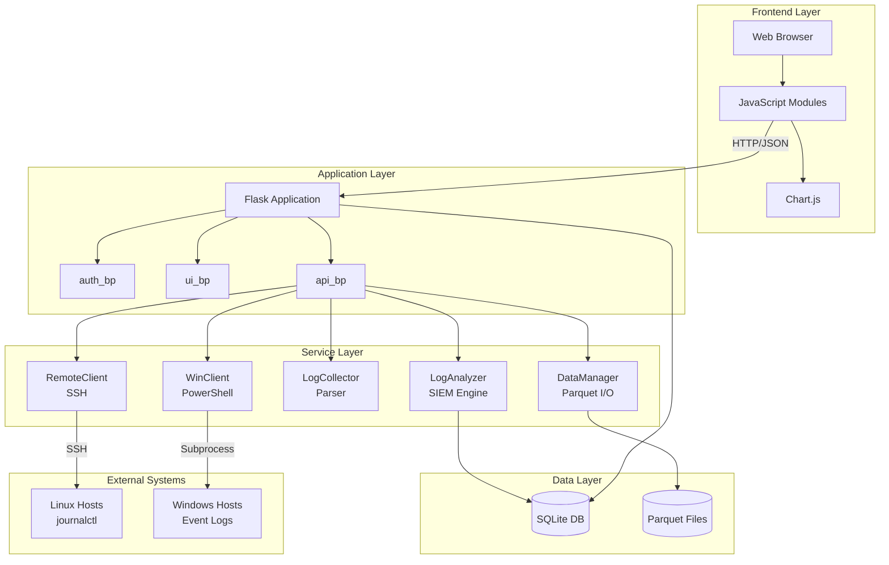
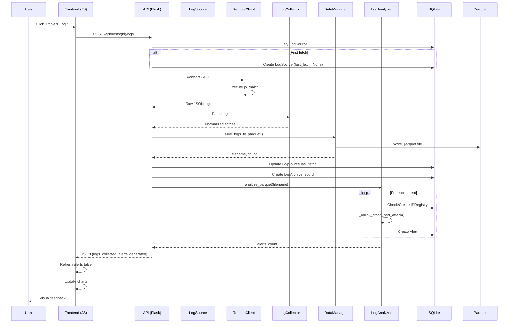
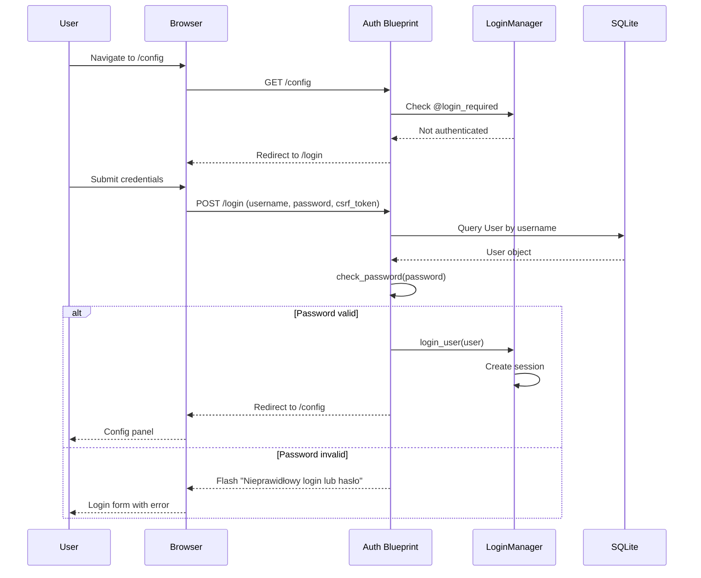

# 📐 Architektura Systemu miniSIEM

<div align="center">

**Dokumentacja Architektoniczna**

</div>

---

## Spis Treści

- [Przegląd Architektury](#przegląd-architektury)
- [Wzorce Projektowe](#wzorce-projektowe)
- [Warstwa Prezentacji](#warstwa-prezentacji)
- [Warstwa Logiki Biznesowej](#warstwa-logiki-biznesowej)
- [Warstwa Danych](#warstwa-danych)
- [Integracje Zewnętrzne](#integracje-zewnętrzne)
- [Diagramy Sekwencji](#diagramy-sekwencji)

---

## Przegląd Architektury

### High-Level Architecture

System miniSIEM został zbudowany w architekturze **3-warstwowej** z wyraźnym podziałem odpowiedzialności:

```
┌─────────────────────────────────────────────────────────────────────────────┐
│                              WARSTWA PREZENTACJI                             │
│  ┌─────────────────────────────────────────────────────────────────────┐    │
│  │                         FRONTEND (Browser)                           │    │
│  │  ┌─────────────┐  ┌─────────────┐  ┌─────────────┐  ┌─────────────┐ │    │
│  │  │  dashboard  │  │    admin    │  │    login    │  │   charts    │ │    │
│  │  │    .js      │  │     .js     │  │    .html    │  │  (Chart.js) │ │    │
│  │  └──────┬──────┘  └──────┬──────┘  └──────┬──────┘  └──────┬──────┘ │    │
│  │         │                │                │                │        │    │
│  │         └────────────────┴────────────────┴────────────────┘        │    │
│  │                                   │                                  │    │
│  │                          ┌────────▼────────┐                         │    │
│  │                          │     api.js      │                         │    │
│  │                          │  (Fetch + CSRF) │                         │    │
│  │                          └────────┬────────┘                         │    │
│  └───────────────────────────────────┼─────────────────────────────────┘    │
│                                      │ HTTP/JSON                             │
│  ┌───────────────────────────────────▼─────────────────────────────────┐    │
│  │                         BACKEND (Flask)                              │    │
│  │  ┌─────────────┐  ┌─────────────┐  ┌─────────────┐                  │    │
│  │  │  auth_bp    │  │   ui_bp     │  │   api_bp    │  ◄── Blueprints  │    │
│  │  │  /login     │  │   / , /cfg  │  │   /api/*    │                  │    │
│  │  └──────┬──────┘  └──────┬──────┘  └──────┬──────┘                  │    │
│  │         │                │                │                          │    │
│  │         └────────────────┴────────────────┘                          │    │
│  │                          │                                           │    │
│  │                 ┌────────▼────────┐                                  │    │
│  │                 │   Extensions    │                                  │    │
│  │                 │ db, login_mgr,  │                                  │    │
│  │                 │ csrf, migrate   │                                  │    │
│  │                 └────────┬────────┘                                  │    │
│  └──────────────────────────┼──────────────────────────────────────────┘    │
└─────────────────────────────┼───────────────────────────────────────────────┘
                              │
┌─────────────────────────────┼───────────────────────────────────────────────┐
│                             │    WARSTWA LOGIKI BIZNESOWEJ                   │
│  ┌──────────────────────────▼──────────────────────────────────────────┐    │
│  │                          SERVICES                                    │    │
│  │  ┌─────────────┐  ┌─────────────┐  ┌─────────────┐  ┌─────────────┐ │    │
│  │  │   Remote    │  │     Win     │  │     Log     │  │     Log     │ │    │
│  │  │   Client    │  │   Client    │  │  Collector  │  │  Analyzer   │ │    │
│  │  │   (SSH)     │  │    (PS)     │  │  (Parser)   │  │   (SIEM)    │ │    │
│  │  └──────┬──────┘  └──────┬──────┘  └──────┬──────┘  └──────┬──────┘ │    │
│  │         │                │                │                │        │    │
│  │         └────────────────┴────────────────┴────────────────┘        │    │
│  │                                   │                                  │    │
│  │                          ┌────────▼────────┐                         │    │
│  │                          │  DataManager    │                         │    │
│  │                          │   (Parquet)     │                         │    │
│  │                          └────────┬────────┘                         │    │
│  └───────────────────────────────────┼─────────────────────────────────┘    │
└─────────────────────────────────────┼───────────────────────────────────────┘
                                      │
┌─────────────────────────────────────┼───────────────────────────────────────┐
│                                     │    WARSTWA DANYCH                      │
│  ┌──────────────────────────────────▼──────────────────────────────────┐    │
│  │                                                                      │    │
│  │  ┌─────────────────────┐           ┌─────────────────────┐          │    │
│  │  │      SQLite DB      │           │   Parquet Storage   │          │    │
│  │  │    (Operational)    │           │     (Forensic)      │          │    │
│  │  │                     │           │                     │          │    │
│  │  │  • Users            │           │  • logs_1_*.parquet │          │    │
│  │  │  • Hosts            │           │  • logs_2_*.parquet │          │    │
│  │  │  • LogSources       │           │  • ...              │          │    │
│  │  │  • LogArchives      │           │                     │          │    │
│  │  │  • IPRegistry       │           │  Immutable archives │          │    │
│  │  │  • Alerts           │           │  for forensic       │          │    │
│  │  │                     │           │  investigation      │          │    │
│  │  └─────────────────────┘           └─────────────────────┘          │    │
│  │                                                                      │    │
│  └──────────────────────────────────────────────────────────────────────┘    │
└──────────────────────────────────────────────────────────────────────────────┘
```

### Diagram Komponentów (Mermaid)



---

## Wzorce Projektowe

### 1. Application Factory Pattern

```python
# app/__init__.py
def create_app(config_class=Config):
    app = Flask(__name__)
    app.config.from_object(config_class)
    
    # Initialize extensions
    db.init_app(app)
    migrate.init_app(app, db)
    csrf.init_app(app)
    login_manager.init_app(app)
    
    # Register blueprints
    app.register_blueprint(ui_bp)
    app.register_blueprint(api_bp, url_prefix='/api')
    app.register_blueprint(auth_bp)
    
    return app
```

**Korzyści:**
- Łatwe testowanie (różne konfiguracje)
- Możliwość tworzenia wielu instancji
- Opóźniona inicjalizacja rozszerzeń

### 2. Blueprint Pattern (Modularność)

```
┌─────────────────────────────────────────────────────────────────┐
│                        BLUEPRINTS                                │
├─────────────────────────────────────────────────────────────────┤
│                                                                  │
│  ┌───────────────────┐                                          │
│  │     auth_bp       │                                          │
│  │   (/login, /out)  │ ──► Autentykacja użytkowników            │
│  └───────────────────┘                                          │
│                                                                  │
│  ┌───────────────────┐                                          │
│  │      ui_bp        │                                          │
│  │   (/, /config)    │ ──► Renderowanie szablonów HTML          │
│  └───────────────────┘                                          │
│                                                                  │
│  ┌───────────────────┐                                          │
│  │      api_bp       │                                          │
│  │   (/api/hosts,    │                                          │
│  │    /api/ips,      │ ──► REST API dla frontendu               │
│  │    /api/alerts)   │                                          │
│  └───────────────────┘                                          │
│                                                                  │
└─────────────────────────────────────────────────────────────────┘
```

### 3. Service Layer Pattern

```
┌─────────────────────────────────────────────────────────────────┐
│                      SERVICE LAYER                               │
├─────────────────────────────────────────────────────────────────┤
│                                                                  │
│                       ┌─────────────┐                           │
│                       │   API BP    │                           │
│                       │ (Controller)│                           │
│                       └──────┬──────┘                           │
│                              │                                   │
│           ┌──────────────────┼──────────────────┐               │
│           │                  │                  │               │
│           ▼                  ▼                  ▼               │
│  ┌─────────────┐    ┌─────────────┐    ┌─────────────┐         │
│  │RemoteClient │    │LogCollector │    │ LogAnalyzer │         │
│  │ (Transport) │    │  (Extract)  │    │ (Transform) │         │
│  └──────┬──────┘    └──────┬──────┘    └──────┬──────┘         │
│         │                  │                  │                 │
│         └──────────────────┼──────────────────┘                 │
│                            │                                     │
│                   ┌────────▼────────┐                           │
│                   │   DataManager   │                           │
│                   │     (Load)      │                           │
│                   └─────────────────┘                           │
│                                                                  │
└─────────────────────────────────────────────────────────────────┘

ETL Pipeline: Extract (Collector) → Transform (Analyzer) → Load (DataManager)
```

### 4. Repository Pattern (ORM)

```python
# Przykład użycia modeli SQLAlchemy

# Query
host = Host.query.get_or_404(host_id)
alerts = Alert.query.filter_by(host_id=host.id).all()

# Create
new_alert = Alert(host_id=1, severity='CRITICAL')
db.session.add(new_alert)
db.session.commit()

# Update
ip_record.status = 'BANNED'
db.session.commit()

# Delete
db.session.delete(host)
db.session.commit()
```

### 5. Context Manager Pattern (Połączenia)

```python
# app/services/remote_client.py

class RemoteClient:
    def __enter__(self):
        self.client = paramiko.SSHClient()
        self.client.connect(...)
        return self
    
    def __exit__(self, exc_type, exc_val, exc_tb):
        if self.client:
            self.client.close()

# Użycie:
with RemoteClient(host=ip, user=user) as client:
    logs = LogCollector.get_linux_logs(client)
# Automatyczne zamknięcie połączenia
```

---

## Warstwa Prezentacji

### Architektura Frontend

```
┌─────────────────────────────────────────────────────────────────┐
│                     FRONTEND ARCHITECTURE                        │
├─────────────────────────────────────────────────────────────────┤
│                                                                  │
│  ┌─────────────────────────────────────────────────────────┐    │
│  │                     main.js (Router)                     │    │
│  │                                                          │    │
│  │   switch(window.location.pathname) {                     │    │
│  │     case '/':        initDashboard();  break;            │    │
│  │     case '/config':  initAdmin();      break;            │    │
│  │   }                                                      │    │
│  └─────────────────────────────────────────────────────────┘    │
│                              │                                   │
│              ┌───────────────┼───────────────┐                  │
│              │               │               │                  │
│              ▼               ▼               ▼                  │
│  ┌─────────────────┐ ┌─────────────────┐ ┌─────────────────┐   │
│  │   dashboard.js  │ │    admin.js     │ │     dom.js      │   │
│  │                 │ │                 │ │   (Helpers)     │   │
│  │ • renderHost()  │ │ • refreshHosts()│ │                 │   │
│  │ • renderAlert() │ │ • refreshIPs()  │ │ • createEl()    │   │
│  │ • initCharts()  │ │ • openModal()   │ │ • clearCont()   │   │
│  └────────┬────────┘ └────────┬────────┘ └─────────────────┘   │
│           │                   │                                  │
│           └───────────────────┘                                  │
│                       │                                          │
│                       ▼                                          │
│  ┌─────────────────────────────────────────────────────────┐    │
│  │                      api.js                              │    │
│  │                                                          │    │
│  │   // CSRF Protection                                     │    │
│  │   function getCSRFToken() {                              │    │
│  │     return document.querySelector('meta[name="csrf"]')   │    │
│  │           .getAttribute('content');                      │    │
│  │   }                                                      │    │
│  │                                                          │    │
│  │   // Wrapped Fetch                                       │    │
│  │   headers: { 'X-CSRFToken': getCSRFToken() }            │    │
│  └─────────────────────────────────────────────────────────┘    │
│                                                                  │
└─────────────────────────────────────────────────────────────────┘
```

### Moduły JavaScript

| Moduł | Odpowiedzialność | Eksportowane funkcje |
|-------|-----------------|---------------------|
| `main.js` | Routing SPA | `main()` |
| `dashboard.js` | Dashboard view | `initDashboard()` |
| `admin.js` | Config panel | `initAdmin()` |
| `api.js` | HTTP client | `fetchHosts()`, `createHost()`, `fetchAlerts()`, ... |
| `dom.js` | DOM utilities | `createEl()`, `clearContainer()` |

### CSS Architecture

```css
/* Root Variables - Design Tokens */
:root {
    --gradient-primary: linear-gradient(135deg, #667eea 0%, #764ba2 100%);
    --gradient-danger: linear-gradient(135deg, #f093fb 0%, #f5576c 100%);
    --shadow-sm: 0 2px 4px rgba(0,0,0,0.1);
    --transition: all 0.3s ease;
}

/* Component-Based Styling */
.host-card { ... }
.host-card.os-linux { border-left-color: #fcc624; }
.host-card.os-windows { border-left-color: #0078d4; }

/* Dark Mode Support */
[data-bs-theme="dark"] .host-card {
    background-color: #1a1d29;
}
```

---

## Warstwa Logiki Biznesowej

### LogCollector - Pobieranie Logów

```
┌─────────────────────────────────────────────────────────────────┐
│                        LOG COLLECTOR                             │
├─────────────────────────────────────────────────────────────────┤
│                                                                  │
│  ┌─────────────────────────────────────────────────────────┐    │
│  │                    get_linux_logs()                      │    │
│  │                                                          │    │
│  │  1. Build journalctl command with --since filter         │    │
│  │  2. Execute via SSH (sudo -S with password piping)       │    │
│  │  3. Parse JSON output line by line                       │    │
│  │  4. Apply regex patterns:                                │    │
│  │     • Failed password for (user) from (ip)               │    │
│  │     • Invalid user (user) from (ip)                      │    │
│  │  5. Return normalized log entries                        │    │
│  └─────────────────────────────────────────────────────────┘    │
│                                                                  │
│  ┌─────────────────────────────────────────────────────────┐    │
│  │                   get_windows_logs()                     │    │
│  │                                                          │    │
│  │  1. Build PowerShell command:                            │    │
│  │     Get-WinEvent -FilterHashtable @{                     │    │
│  │       LogName='Security'; Id=4625                        │    │
│  │     }                                                    │    │
│  │  2. Extract XML fields: IpAddress, TargetUserName        │    │
│  │  3. Convert to JSON                                      │    │
│  │  4. Parse and normalize                                  │    │
│  │  5. Return log entries                                   │    │
│  └─────────────────────────────────────────────────────────┘    │
│                                                                  │
│  ┌─────────────────────────────────────────────────────────┐    │
│  │                    Output Format                         │    │
│  │                                                          │    │
│  │  {                                                       │    │
│  │    'timestamp': datetime,                                │    │
│  │    'alert_type': 'FAILED_LOGIN' | 'INVALID_USER' | ..., │    │
│  │    'source_ip': '192.168.1.50',                         │    │
│  │    'user': 'admin',                                      │    │
│  │    'message': 'Full log message',                        │    │
│  │    'raw_log': 'Original log entry'                       │    │
│  │  }                                                       │    │
│  └─────────────────────────────────────────────────────────┘    │
│                                                                  │
└─────────────────────────────────────────────────────────────────┘
```

### LogAnalyzer - Silnik SIEM

```
┌─────────────────────────────────────────────────────────────────┐
│                        LOG ANALYZER                              │
├─────────────────────────────────────────────────────────────────┤
│                                                                  │
│  ┌─────────────────────────────────────────────────────────┐    │
│  │                   analyze_parquet()                      │    │
│  │                                                          │    │
│  │  INPUT: filename, host_id                                │    │
│  │                                                          │    │
│  │  1. Load DataFrame from Parquet                          │    │
│  │  2. Filter attack patterns:                              │    │
│  │     ['FAILED_LOGIN', 'INVALID_USER', 'WIN_FAILED_LOGIN'] │    │
│  │  3. For each threat:                                     │    │
│  │     a) Check/create IPRegistry entry                     │    │
│  │     b) Check cross-host correlation                      │    │
│  │     c) Determine severity based on IP status             │    │
│  │     d) Deduplicate (skip existing alerts)                │    │
│  │     e) Create Alert record                               │    │
│  │  4. Commit all changes                                   │    │
│  │                                                          │    │
│  │  OUTPUT: alerts_created (int)                            │    │
│  └─────────────────────────────────────────────────────────┘    │
│                                                                  │
│  ┌─────────────────────────────────────────────────────────┐    │
│  │              _check_cross_host_attack()                  │    │
│  │                                                          │    │
│  │  Algorytm korelacji między hostami:                      │    │
│  │                                                          │    │
│  │  IF ip_status == 'UNKNOWN':                              │    │
│  │    recent_attacks = Query alerts WHERE                   │    │
│  │      source_ip = this_ip AND                             │    │
│  │      timestamp >= now - 10 minutes                       │    │
│  │                                                          │    │
│  │    attacked_hosts = {alert.host_id for alert in recent}  │    │
│  │    attacked_hosts.add(current_host_id)                   │    │
│  │                                                          │    │
│  │    IF len(attacked_hosts) >= 2:                          │    │
│  │      → AUTO-BAN IP                                       │    │
│  │      → Return True                                       │    │
│  │                                                          │    │
│  │  Return False                                            │    │
│  └─────────────────────────────────────────────────────────┘    │
│                                                                  │
└─────────────────────────────────────────────────────────────────┘
```

### Macierz Severity

```
┌─────────────────────────────────────────────────────────────────┐
│                     SEVERITY MATRIX                              │
├─────────────────────────────────────────────────────────────────┤
│                                                                  │
│    IP Status      │  Cross-Host  │   Severity   │   Action      │
│  ─────────────────┼──────────────┼──────────────┼─────────────  │
│    BANNED         │      -       │   CRITICAL   │   Alert       │
│    UNKNOWN        │     YES      │   CRITICAL   │   Auto-Ban    │
│    UNKNOWN        │     NO       │   WARNING    │   Monitor     │
│    TRUSTED        │      -       │   INFO       │   Log only    │
│                                                                  │
│  Przykład wiadomości alertu:                                    │
│                                                                  │
│  CRITICAL (BANNED):                                             │
│    "⚠️ ATAK Z ZBANOWANEGO IP! 192.168.1.50 próbował            │
│     zalogować się jako 'admin'"                                 │
│                                                                  │
│  CRITICAL (Cross-Host):                                         │
│    "🚨 MULTI-HOST ATTACK! IP 192.168.1.50 zaatakował            │
│     wiele hostów i został automatycznie zbanowany!"             │
│                                                                  │
│  WARNING:                                                       │
│    "Nieudane logowanie z nieznanego IP 192.168.1.50             │
│     jako 'admin'"                                               │
│                                                                  │
│  INFO:                                                          │
│    "Nieudane logowanie z zaufanego IP 192.168.1.1               │
│     jako 'admin' (możliwy błąd użytkownika)"                    │
│                                                                  │
└─────────────────────────────────────────────────────────────────┘
```

---

## Warstwa Danych

### Model ERD (Entity Relationship Diagram)

```
┌─────────────────────────────────────────────────────────────────┐
│                    ENTITY RELATIONSHIP DIAGRAM                   │
├─────────────────────────────────────────────────────────────────┤
│                                                                  │
│     ┌─────────────┐                                             │
│     │    User     │                                             │
│     ├─────────────┤                                             │
│     │ id: PK      │                                             │
│     │ username    │                                             │
│     │ password_   │                                             │
│     │   hash      │                                             │
│     └─────────────┘                                             │
│                                                                  │
│                                                                  │
│     ┌─────────────┐         ┌─────────────┐                     │
│     │  IPRegistry │         │    Host     │                     │
│     ├─────────────┤         ├─────────────┤                     │
│     │ id: PK      │         │ id: PK      │                     │
│     │ ip_address  │         │ hostname    │                     │
│     │ status      │         │ ip_address  │                     │
│     │ last_seen   │         │ os_type     │                     │
│     └─────────────┘         └──────┬──────┘                     │
│            ▲                       │                             │
│            │                       │ 1:N                         │
│            │              ┌────────┼────────┐                   │
│     (lookup by IP)        │        │        │                   │
│            │              ▼        ▼        ▼                   │
│            │     ┌──────────┐ ┌──────────┐ ┌──────────┐         │
│            │     │LogSource │ │LogArchive│ │  Alert   │         │
│            │     ├──────────┤ ├──────────┤ ├──────────┤         │
│            │     │id: PK    │ │id: PK    │ │id: PK    │         │
│            │     │host_id:FK│ │host_id:FK│ │host_id:FK│         │
│            │     │log_type  │ │filename  │ │timestamp │         │
│            └─────│last_fetch│ │record_cnt│ │alert_type│         │
│                  └──────────┘ │timestamp │ │message   │         │
│                               └──────────┘ │severity  │         │
│                                            │source_ip │◄────────┘
│                                            └──────────┘         │
│                                                                  │
└─────────────────────────────────────────────────────────────────┘
```

### Dual Storage Strategy

```
┌─────────────────────────────────────────────────────────────────┐
│                   DUAL STORAGE STRATEGY                          │
├─────────────────────────────────────────────────────────────────┤
│                                                                  │
│  ┌────────────────────────────┬────────────────────────────┐    │
│  │        SQLite DB           │       Parquet Files        │    │
│  ├────────────────────────────┼────────────────────────────┤    │
│  │                            │                            │    │
│  │  Przeznaczenie:            │  Przeznaczenie:            │    │
│  │  • Operational data        │  • Forensic archives       │    │
│  │  • User sessions           │  • Raw log preservation    │    │
│  │  • Alert management        │  • Compliance/audit trail  │    │
│  │  • IP reputation           │                            │    │
│  │                            │                            │    │
│  │  Charakterystyka:          │  Charakterystyka:          │    │
│  │  • Mutable                 │  • Immutable (append-only) │    │
│  │  • ACID transactions       │  • Columnar compression    │    │
│  │  • Fast random access      │  • Efficient analytics     │    │
│  │  • Small dataset           │  • Large dataset ready     │    │
│  │                            │                            │    │
│  │  Ścieżka:                  │  Ścieżka:                  │    │
│  │  instance/lab8.db          │  storage/logs_*.parquet    │    │
│  │                            │                            │    │
│  └────────────────────────────┴────────────────────────────┘    │
│                                                                  │
│  Dlaczego Parquet dla forensics?                                │
│                                                                  │
│  1. NIEMODYFIKOWALNOŚĆ - Pliki timestampowane, nie edytujemy    │
│  2. KOMPRESJA - 10x mniejsze niż JSON/CSV                       │
│  3. SCHEMA - Struktura danych zachowana w pliku                 │
│  4. PANDAS - Native support, szybka analiza ad-hoc              │
│  5. INDUSTRY STANDARD - Format używany w Big Data               │
│                                                                  │
│  Naming convention: logs_{host_id}_{YYYYMMDD_HHMMSS}.parquet    │
│                                                                  │
└─────────────────────────────────────────────────────────────────┘
```

---

## Integracje Zewnętrzne

### SSH Connection (Linux)

```
┌─────────────────────────────────────────────────────────────────┐
│                    SSH CONNECTION FLOW                           │
├─────────────────────────────────────────────────────────────────┤
│                                                                  │
│  miniSIEM                              Linux Host                │
│  ────────                              ──────────                │
│      │                                      │                    │
│      │  1. SSH Connect (paramiko)           │                    │
│      │  ─────────────────────────────────►  │                    │
│      │     host, user, port, password       │                    │
│      │                                      │                    │
│      │  2. Execute Command                  │                    │
│      │  ─────────────────────────────────►  │                    │
│      │     printf 'pass' | sudo -S          │                    │
│      │     journalctl -u ssh -o json        │                    │
│      │     --since "2025-01-01 00:00:00"    │                    │
│      │                                      │                    │
│      │  3. JSON Response                    │                    │
│      │  ◄─────────────────────────────────  │                    │
│      │     {"MESSAGE":"Failed password...", │                    │
│      │      "__REALTIME_TIMESTAMP":...}     │                    │
│      │                                      │                    │
│      │  4. Close Connection                 │                    │
│      │  ─────────────────────────────────►  │                    │
│      │                                      │                    │
│                                                                  │
│  Konfiguracja w .env:                                           │
│  ────────────────────                                           │
│  SSH_DEFAULT_HOST=192.168.1.100                                 │
│  SSH_DEFAULT_USER=kali                                          │
│  SSH_DEFAULT_PORT=22                                            │
│  SSH_PASSWORD=kali                                              │
│                                                                  │
└─────────────────────────────────────────────────────────────────┘
```

### PowerShell Connection (Windows)

```
┌─────────────────────────────────────────────────────────────────┐
│                 POWERSHELL EXECUTION FLOW                        │
├─────────────────────────────────────────────────────────────────┤
│                                                                  │
│  miniSIEM (Flask)                      Windows OS                │
│  ────────────────                      ──────────                │
│      │                                      │                    │
│      │  1. subprocess.run()                 │                    │
│      │  ─────────────────────────────────►  │                    │
│      │     powershell -Command "..."        │                    │
│      │                                      │                    │
│      │  2. Get-WinEvent                     │                    │
│      │  ─────────────────────────────────►  │                    │
│      │     -FilterHashtable @{              │                    │
│      │       LogName='Security';            │                    │
│      │       Id=4625                        │                    │
│      │     } -MaxEvents 20                  │                    │
│      │                                      │                    │
│      │  3. XML Parsing + JSON Output        │                    │
│      │  ◄─────────────────────────────────  │                    │
│      │     [{"Timestamp":"...",             │                    │
│      │       "IpAddress":"...",             │                    │
│      │       "TargetUserName":"..."}]       │                    │
│      │                                      │                    │
│                                                                  │
│  Event ID 4625 - Failed Logon Attempt                           │
│  Zawiera: Source IP, Target Username, Failure Reason            │
│                                                                  │
└─────────────────────────────────────────────────────────────────┘
```

---

## Diagramy Sekwencji

### Pełny Cykl Pobierania Logów



### Proces Autentykacji



---

## Deployment Architecture

```
┌─────────────────────────────────────────────────────────────────┐
│                   DEPLOYMENT ARCHITECTURE                        │
├─────────────────────────────────────────────────────────────────┤
│                                                                  │
│  ┌─────────────────────────────────────────────────────────┐    │
│  │                    DEVELOPMENT                           │    │
│  │                                                          │    │
│  │  Flask Development Server (flask run)                    │    │
│  │  ├── Host: 127.0.0.1:5000                               │    │
│  │  ├── Debug: ON                                          │    │
│  │  └── Auto-reload: ON                                    │    │
│  │                                                          │    │
│  └─────────────────────────────────────────────────────────┘    │
│                                                                  │
│  ┌─────────────────────────────────────────────────────────┐    │
│  │                    PRODUCTION (Future)                   │    │
│  │                                                          │    │
│  │  ┌─────────┐    ┌─────────┐    ┌─────────┐             │    │
│  │  │  Nginx  │───▶│ Gunicorn│───▶│  Flask  │             │    │
│  │  │ (Proxy) │    │ (WSGI)  │    │  (App)  │             │    │
│  │  └─────────┘    └─────────┘    └─────────┘             │    │
│  │       │                                                  │    │
│  │       ▼                                                  │    │
│  │  SSL/TLS termination                                    │    │
│  │  Static files serving                                   │    │
│  │  Load balancing                                         │    │
│  │                                                          │    │
│  └─────────────────────────────────────────────────────────┘    │
│                                                                  │
└─────────────────────────────────────────────────────────────────┘
```

---

<div align="center">

**[← Powrót do README](./README.md)** | **[API Documentation →](./API.md)**

</div>